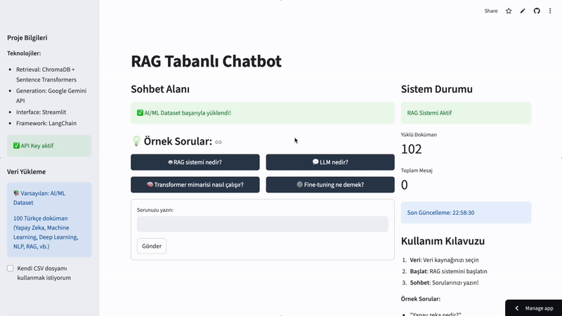

# RAG Tabanlı Chatbot Projesi

Bu proje, **Retrieval-Augmented Generation (RAG)** teknolojisini kullanarak geliştirilmiş akıllı bir chatbot sistemidir. Sistem, dokümanlardan bilgi çıkararak kullanıcı sorularına bağlamsal ve doğru yanıtlar üretir.

## Proje Amacı

Büyük dil modellerinin (LLM) bilgi retrieval sistemiyle birleştirilerek daha doğru ve bağlamsal yanıtlar üretebilen bir chatbot geliştirmek. RAG yaklaşımı sayesinde model, dinamik olarak sağlanan dokümanlardan bilgi çekerek yanıt verebilir.

## Dataset

Proje **varsayılan olarak AI/ML Dataset** kullanır:

### AI/ML Dataset (Varsayılan)
`data/sample_data.csv` dosyasında bulunan **yapay zeka ve makine öğrenmesi** konulu Türkçe içerik.

- **100 Türkçe doküman** (Sentetik veri - AI tarafından oluşturulmuştur)
- **Kapsam:** Yapay Zeka, Machine Learning, Deep Learning, NLP, RAG, LLM'ler, Transformer, Computer Vision, MLOps, vb.
- Her doküman AI/ML konularında detaylı bilgi içerir
- Türkçe, anlaşılır ve güncel içerik

### Özel Veri Yükleme (Opsiyonel)
Kullanıcılar kendi CSV dosyalarını da sisteme yükleyebilir. CSV formatı:
```csv
content
"İlk doküman içeriği"
"İkinci doküman içeriği"
...
```

## Kullanılan Teknolojiler

- **Embedding Model**: `all-MiniLM-L6-v2` (Sentence Transformers)
- **Vektör Veritabanı**: ChromaDB
- **LLM**: Google Gemini Pro API
- **Web Arayüzü**: Streamlit

## Kurulum ve Çalıştırma

### Gereksinimler
- Python 3.8+
- Google Gemini API Key ([buradan alın](https://ai.google.dev/))

### Kurulum Adımları
```bash
# 1. Projeyi klonlayın
git clone https://github.com/helinasli/rag-chatbot.git
cd rag-chatbot

# 2. Virtual environment oluşturun ve aktive edin
python -m venv venv
source venv/bin/activate  # macOS/Linux
# veya
venv\Scripts\activate  # Windows

# 3. Bağımlılıkları yükleyin
pip install -r requirements.txt

# 4. .env dosyası oluşturun ve API key'inizi ekleyin
echo "GEMINI_API_KEY=your_api_key_here" > .env
```

### Çalıştırma
```bash
streamlit run app.py
```

## Nasıl Çalışır?

1. Dokümanlar yüklenir ve embedding vektörlerine dönüştürülür
2. Vektörler ChromaDB'de saklanır
3. Kullanıcı sorgusu vektörize edilir
4. En benzer dokümanlar bulunur
5. LLM ile bağlamsal yanıt üretilir

## Deploy Link & Demo

🔗 [RAG Chatbot - Link](https://rag-chatbot-genai-akbank.streamlit.app/)

### 📹 Kılavuz Videosu




### Kullanım Adımları

1. Uygulamayı açın - **RAG sistemi otomatik başlar**
   - AI/ML Dataset anında yüklenir
   - 100+ AI/ML konulu Türkçe doküman hazır
2. API key'inizi girin (sidebar)
3. Sorularınızı sorun!

**Örnek Sorular:**
- "RAG sistemi nedir?"
- "Transformer mimarisi nasıl çalışır?"
- "LLM nedir?"
- "Fine-tuning ne demek?"

**Not:** İsterseniz kendi CSV dosyanızı da yükleyebilirsiniz (sidebar)


## Proje Yapısı

```
rag-chatbot/
├── src/
│   └── rag_system.py          # Ana RAG sistemi
├── data/
│   └── sample_data.csv        # Örnek veri seti
├── app.py                     # Streamlit web uygulaması
├── requirements.txt           # Python bağımlılıkları
└── README.md                  # Bu dosya
```

## Lisans

Bu proje MIT lisansı altında lisanslanmıştır.

